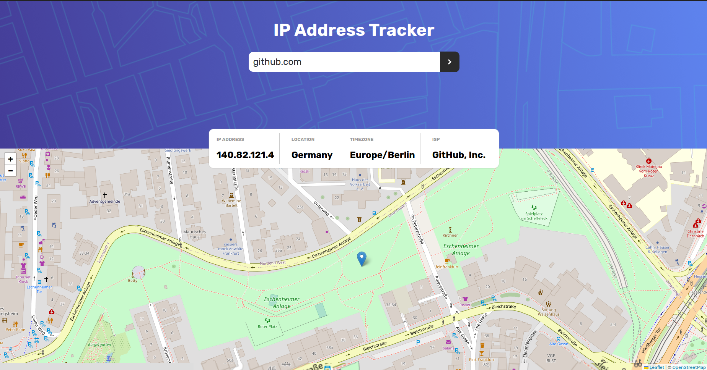

# Frontend Mentor - IP address tracker solution

This is a solution to the [IP address tracker challenge on Frontend Mentor](https://www.frontendmentor.io/challenges/ip-address-tracker-I8-0yYAH0). Frontend Mentor challenges help you improve your coding skills by building realistic projects. 

## Table of contents

  - [The challenge](#the-challenge)
  - [Screenshot](#screenshot)
  - [Links](#links)
- [My process](#my-process)
  - [Built with](#built-with)
  - [Useful resources](#useful-resources)
- [Author](#author)
- [Acknowledgments](#acknowledgments)

### The challenge

Users should be able to:

- View the optimal layout for each page depending on their device's screen size
- See hover states for all interactive elements on the page
- See their own IP address on the map on the initial page load
- Search for any IP addresses or domains and see the key information and location

### Screenshot

### Links

- Solution URL: [Add solution URL here](https://your-solution-url.com)
- Live Site URL: [Live Site](https://dennydoesfrontend.github.io/IP-Address-Tracker-Website/)

## My process

Built out the page using HTML and SASS/SCSS. i couldn't use ipify for this project due to the fact that I had to use an ApiKey(token) and the coordinates for latitude and longitude were not available in the data returned from the API. I then decided to use ip-api API which provides the lat and long coordinates. I used Leaflet js library to generate the map and using the latitude and longitude coordinates from the ip-api API, I was able to configure and link the two APIs to work together. This project was very exciting and made me feel like I was gradually becoming a better developer.

### Built with

- Semantic HTML5 markup
- SCSS/SASS
-Vanilla JS

### Useful resources

- [Abstract-API](https://www.abstractapi.com/) - This helped me get the coordinates for the IP Addresses on the map without the need for any API Key.

## Author
- Frontend Mentor - [@DennyIsNaive](https://www.frontendmentor.io/profile/DennyIsNaive)
- Twitter - [@denzelashiteyfd](https://www.twitter.com/denzelashiteyfd)

